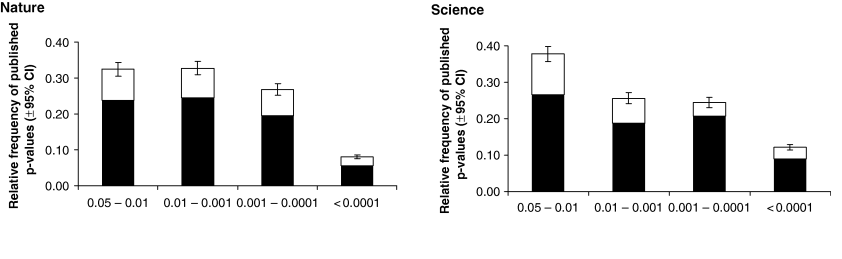

```{r setup, include=FALSE}
options(htmltools.dir.version = FALSE, echo = FALSE)
library(tidyverse)
library(palmerpenguins)
library(cowplot)
```

```{r xaringan-themer, include=FALSE, warning=FALSE}
library(xaringanthemer)
style_duo_accent(
primary_color = "#035AA6",
  secondary_color = "#97aaba",
  inverse_header_color = "#FFFFFF", 
 link_color = "rgb(249, 38, 114)",
      code_font_family = "GlacialIndifferenceRegular",
code_highlight_color = "rgba(255,255,0,0.5)",
  code_font_url = "https://fontlibrary.org/face/glacial-indifference",
  text_font_family = "GlacialIndifferenceRegular",
  text_font_size = "25px",
  text_font_url = "https://fontlibrary.org/face/glacial-indifference",
  header_font_family = "Sifonn",
  header_font_url = "https://fonts.cdnfonts.com/css/sifonn",
)

```


# Hello! 👋

.pull-left[


- How are you doing today?

- Go to Slido.com `#769388`

]
.pull-right[


```{r, echo=FALSE, out.width="60%"}
knitr::include_graphics("images/qr.png")
```

]

---

# Open Science

* A survey in 2015 estimated the % of published papers in STEM subjects that included accompanying raw data

--

* Only 13% of research articles included raw data

.footnote[[Refs] 10.1371/journal.pone.0143460]

---

# "Reasons" not to share

* Fear of being "scooped"

* Patent applications

* Confidentiality - unclear about data protection

* Lack of technical ability

---

# The Reproducibility crisis in Science

* In a 2011 study it was reported that only 25% of cancer research studies could be replicated or reproduced

* Inappropriate practices of science include:

  * HARKing
  * P-hacking
  * Selective reporting
  * Poor research design
  * Publication bias


.footnote[[Refs]10.1038/nrd3439-c1]
---

# HARKing

HARKing (**H**ypothesizing **A**fter the **R**esults are **K**nown)

* Dismissing or neglecting to report on rejected *apriori* hypotheses

* Generating *new* hypotheses after collecting and analyzing data

.pull-left[

Can increase **Type 1 errors**

]

.pull-right[

Motivated by difficulty in publishing *null* results

]

---

# Confirmatory vs. Exploratory Science

Exploratory analysis is not the problem!

--

```{r, echo=FALSE, out.width="100%"}

```

.footnote[[Refs]10.1186/s13059-020-02133-w]

---

# P-hacking

Performing many statistical tests on the data and only reporting those that come back with significant results

```{r, echo=FALSE, out.width="90%"}

```


.footnote[[Refs]10.1111/j.1420-9101.2006.01291.x]
---

# P-hacking

Widespread - but probably not but weak compared to the effect sizes being measured?

```{r, echo=FALSE, out.width="70%"}

```

.footnote[[Refs]10.1371/journal.pbio.1002106]
---

# Publication bias

* Significant results are more associate with *top* journals

* Novelty is prized

* Employers and funders count papers (weighted by journal impact) to assess performance

---
# Mistakes vs. Fraud

* How prevalent is scientific misconduct?
      * 2% of scientists admit to having fabricated, falsified, or modified data at least once 
      * Serial offenders thought to be primary drivers

* How can we prevent it & catch genuine mistakes or errors?

.footnote[[]

https://ecoevoevoeco.blogspot.com/2020/02/integrityandtrust-idea-3-collaborate.html

https://dynamicecology.wordpress.com/2020/02/17/some-data-and-historical-perspective-on-scientific-misconduct/
]

---

# What can we do?

* Collaborative data analysis

* Share data *and* analyses

* Must be understandable

---

# Version control

.pull-left[

If you use Office 365 or Google Docs, you are already using version control

]

.pull-right[

```{r, echo=FALSE, out.width="100%"}

```
]


---

# GitHub

* Git a free and open-source version control system

* GitHub a hosting system for Git that we can easily interact with using R and RStudio

* Set up a connection and your RStudio project can be Pushed to a repository on GitHub

* Fully collaborative, open, reproducible analyses

* Can be *archived* when ready to publish with a doi

---

# Repositories

.pull-left[
## Specialist

* Genbank

* SRA

* UniProtKB

* The Cancer Imaging Archive


.footnote[https://www.nature.com/sdata/policies/repositories#nuc]
]

.pull-right[

## General

* Figshare

* Zenodo

* Dryad

]

---

# Code readability

* What are some ways we can make our code readable?

--

* Frequent comments

* Pipes

* Use objects that make sense/relevance

* Organise directories and folders

* Provide READMEs

---

class: center, middle


# ♻
# Thank you!
# Next-time: Misleading figures!


