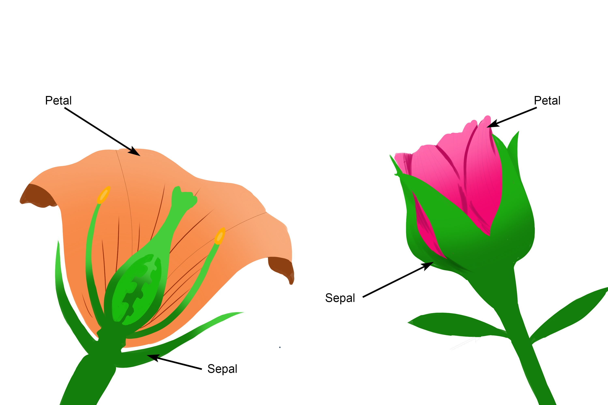
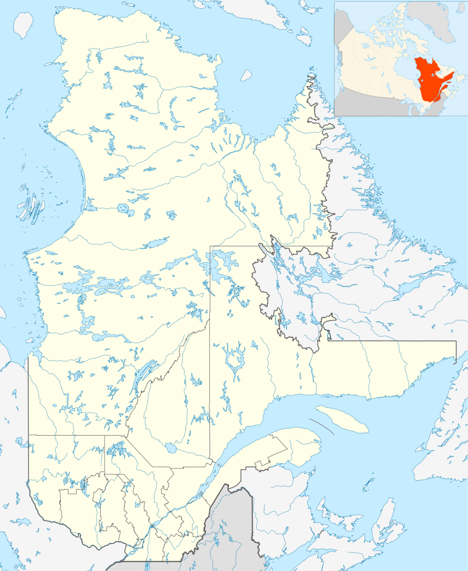
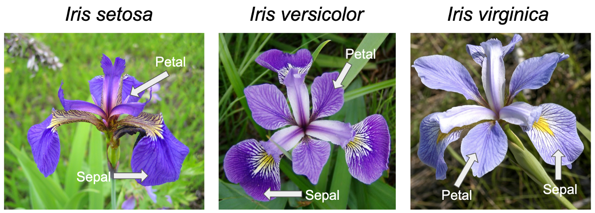
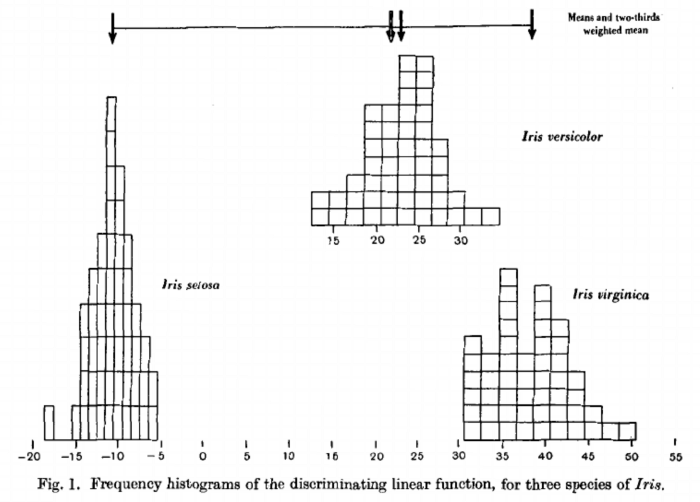
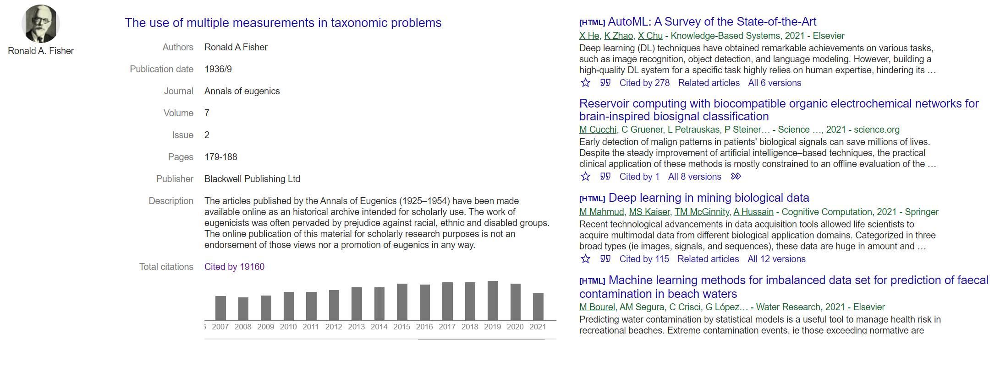
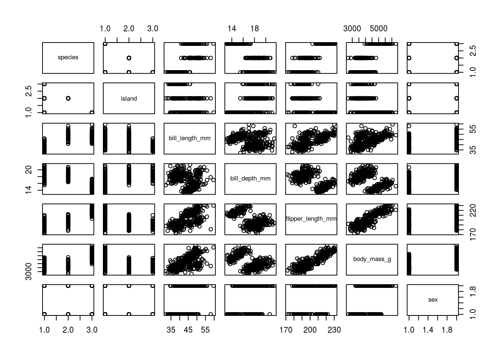

```{r setup, include=FALSE}
options(htmltools.dir.version = FALSE, echo = FALSE)
library(tidyverse)
library(palmerpenguins)
library(cowplot)
library(ggbeeswarm)
library(kableExtra)
```

```{r xaringan-themer, include=FALSE, warning=FALSE}
library(xaringanthemer)
style_duo_accent(
primary_color = "#035AA6",
  secondary_color = "#97aaba",
  inverse_header_color = "#FFFFFF", 
 link_color = "rgb(249, 38, 114)",
      code_font_family = "GlacialIndifferenceRegular",
code_highlight_color = "rgba(255,255,0,0.5)",
  code_font_url = "https://fontlibrary.org/face/glacial-indifference",
  text_font_family = "GlacialIndifferenceRegular",
  text_font_size = "25px",
  text_font_url = "https://fontlibrary.org/face/glacial-indifference",
  header_font_family = "Sifonn",
  header_font_url = "https://fonts.cdnfonts.com/css/sifonn",
)

```

class: center, middle, inverse


# 💻 Data Ethics 💻

[Today we will investigate where our data comes from, and the ethics of collection and use]


---

# Iris flower dataset

R has a number of 'built-in' datasets

.pull-left[
* mtcars: Motor Trend Car Road Tests
* ToothGrowth
* PlantGrowth
]

.pull-right[
* USArrests
* iris
]
.left-code[
```{r eval=FALSE}
head(iris)
```
]

.right-plot[
```{r echo=FALSE, warning=FALSE, message=FALSE}
head(iris) 
```
]


---

#The Iris dataset

.pull-left[

The iris dataset includes four continuous variables (measurements):

* Sepal length

* Sepal width

* Petal length

* Petal width

And one categorical variable:

* Species
]

.pull-right[

```{r, echo=FALSE, fig.alt= "", out.width="100%"}

```
]


---

# Data science concepts

.left-code[
```{r eval=FALSE}
iris %>% 
  ggplot(aes(x=Petal.Length, 
             y=Petal.Width, 
             color=Species))+
  geom_point(aes(shape=Species))+
  theme_void()
```
* Machine learning

* Linear discriminant analysis
]

.right-plot[
```{r echo=FALSE, warning=FALSE, message=FALSE, out.width="90%"}
iris %>% 
  ggplot(aes(x=Petal.Length, 
             y=Petal.Width, 
             color=Species))+
  geom_point(aes(shape=Species))+
  theme_void() 
```
]


---
class: center

# Where does the data come from?

Collected by the botanist Dr. Edgar Anderson, who collected most of the data from the Gaspé Peninsula, in Canada

```{r, echo=FALSE, fig.alt= "", out.width="55%"}

```

---
class: center

# Where does the data come from?

Collected by the botanist Dr. Edgar Anderson, who collected most of the data from the Gaspé Peninsula, in Canada

```{r, echo=FALSE, fig.alt= "", out.width="25%"}

```

---

class: center

# Where does the data come from?

Most of the data collected on a single day in 1935

```{r, echo=FALSE, fig.alt= "", out.width="100%"}

```

---

class: center

# Ronald Fisher (1890-1962)

Edgar had accepted a fellowship in 1929 to work in Britain with several other scientists, among them Sir Ronald Fisher

Through this collaboration Fisher obtained permission to use the data in his own research paper

```{r, echo=FALSE, fig.alt= "", out.width="20%"}

```

---
class: center

# Who was Fisher?

*"Single-handedly created the foundations for modern statistical science"* Hald (1988)

.pull-left[

## Statistics

* Fisher's exact Test

* ANOVA

* Student's t-distribution

* Null hypothesis testing
]

.pull-right[

## Genetics

* Gene linkage

* Fisherian selection

* Reproductive value

* Mimicry

* Heterozygotic advantage

]

---
class: center

# Publication

```{r, echo=FALSE, fig.alt= "", out.width="60%"}

```

Fisher, R. A. (1936) The use of multiple measurements in taxonomic problems. Annals of Eugenics, 7, Part II, 179–188.


---

# Eugenics

Fisher was an unrepentant Eugenicist

* 1911 -Founding chairman of the University of Cambridge Eugenics Society

* Attributed the fall of civilisations to a reduction in fertility of the upper classes

* Genes over environment on many social issues e.g. smoking

* Supported known associates of the Nazi party before and after WWII


---

# Understand the origin of your data

```{r, echo=FALSE, fig.alt= "", out.width="100%"}

```

---

# What can we do?

Stop using Iris?

```{r, echo=FALSE, fig.alt= "", out.width="90%"}
knitr::include_graphics("images/lter_penguins.png")
```
---

# What can we do?

Stop using Iris!

```{r, echo=FALSE, fig.alt= "", out.width="80%"}

```
---

# Data Ethics

* All data has a source and background

* Data Reproducibility

* Misrepresentation

* Bias

* Impact


---

class: center, middle


# ♻
# Thank you!
# Questions?


