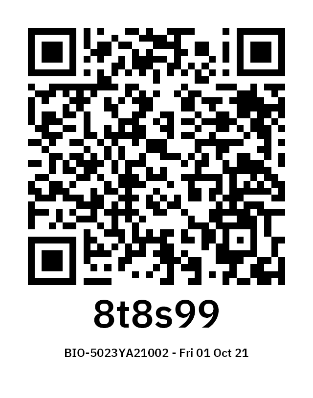
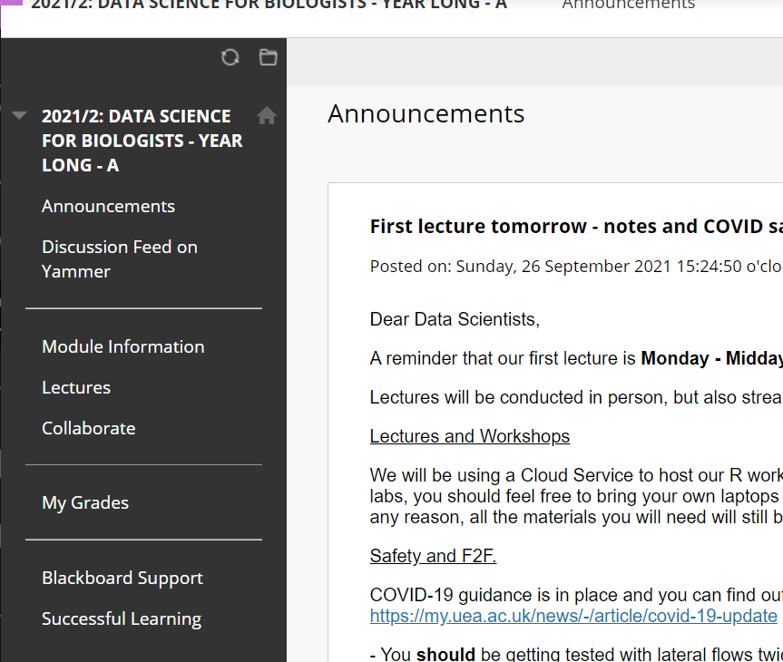
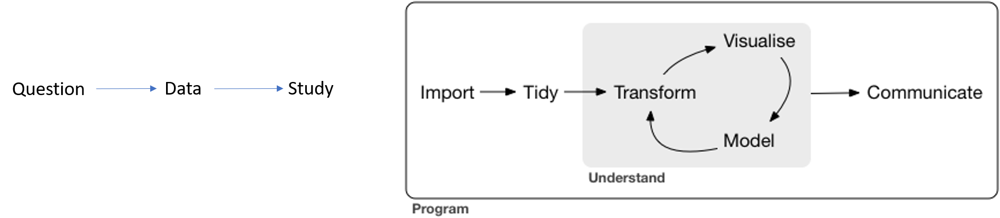
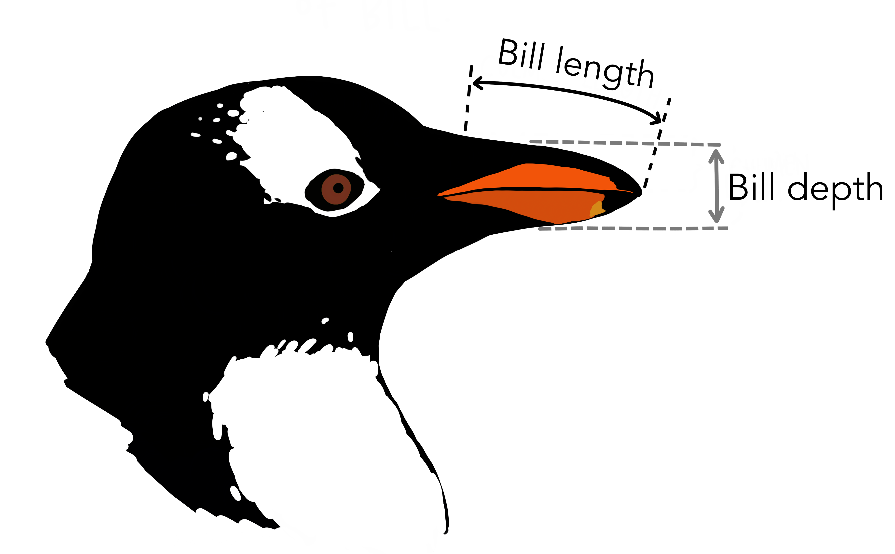

```{r setup, include=FALSE}
options(htmltools.dir.version = FALSE, echo = FALSE)
library(tidyverse)
library(palmerpenguins)
library(cowplot)
```

```{r xaringan-themer, include=FALSE, warning=FALSE}
library(xaringanthemer)
style_duo_accent(
primary_color = "#035AA6",
  secondary_color = "#97aaba",
  inverse_header_color = "#FFFFFF", 
 link_color = "rgb(249, 38, 114)",
      code_font_family = "GlacialIndifferenceRegular",
code_highlight_color = "rgba(255,255,0,0.5)",
  code_font_url = "https://fontlibrary.org/face/glacial-indifference",
  text_font_family = "GlacialIndifferenceRegular",
  text_font_size = "25px",
  text_font_url = "https://fontlibrary.org/face/glacial-indifference",
  header_font_family = "Sifonn",
  header_font_url = "https://fonts.cdnfonts.com/css/sifonn",
)

```


# COVID-safety

* Information [UEA COVID-19 Advice](https://www.uea.ac.uk/about/news/statements/covid-19-advice)

* Take Lateral flow tests on **Mondays** & **Thursdays**

* Self-isolate and get a **PCR** test if unwell or any symptoms

* Wear **Face-coverings** indoors


---

# Hello! 👋

.pull-left[
## Welcome to Data Science

- How are you doing today?

- What made you sign up for this module?

- Go to Slido.com `#602443`

]
.pull-right[
## Attendance

```{r, echo=FALSE, out.width="60%"}

```

]

---

# Timetables

* Check *Timetabler* regularly for updates/changes

* One lecture per week - In-person/Collaborate

* One workshop per week
    * Can bring own laptop
    * Streamed but not recorded

---

# Blackboard
.pull-left[
* Announcements

* Yammer Feed

* Module Information

* Lecture Slides

* Collaborate Link

* Assessment Briefs
]

.pull-right[
```{r, echo=FALSE}

```
]

---

# Assessment

All coursework, no exam

* 40% Summative this term

* 60% Summative next term

---

class: center

# What is Data Science? 

```{r, echo=FALSE, out.width="60%", fig.alt= "Venn diagram of subject expertise, programming, maths & statistics"}
knitr::include_graphics("images/Data_Science_VD.png")
```

---

# Insights from Data

* Clear, deep understanding of a complicated problem or situation

--

* Become better scientists

--

* Gain programming and analysis skills that are in demand by business

---
class: center

# Data is big business

```{r, echo=FALSE, out.width="60%", fig.alt= "Venn diagram of subject expertise, programming, maths & statistics"}
knitr::include_graphics("images/Business.png")
```

---


# Data is big business

* Fitbit

* Amazon

* Aviva

* Open Health Foundation

* Local/National COVID strategies

---


# What can Data do?

* Increase Revenues

* Open new markets

* Improve efficiencies

* Provide insights

* Make predictions

---


# Become a better scientist

* A better platfom to generate and test hypotheses

* Produce better data visuals

* Gain the statistical tools to describe and predict from data

* Understand the importance of "open" and "reproducible" research

---


# Our process

```{r, echo=FALSE, fig.alt= "Venn diagram of subject expertise, programming, maths & statistics"}

```

* We will use the programming language R - it is fun, flexible and will empower you to be a better Scientist.


---

# Questions

The starting point of gaining insights should always be the Question, not the Data

* Is there a pattern/relationship that matches our expectations?

* Can we ascribe causation?

* Can we make predictions?

---


class: center, middle, inverse

# Hypothesis

# Turn a question into a hypothesis

---

# Where does data come from?

* Controlled experiments

* 'Field' experiments

* Exploratory studies

---

# Data

What is data?

* Data are records/observations/measurements

--

* Data can be quantitative
    * Values
    * Continuous
    * Integer
    * Categorical
--

* Data can be qualitative
    * Opinion polls
    * Text mining
    * Colours
    
---
# Insights from Data

* A dataset is a collection of data

* There are many ways to arrange datasets

* We aim to cut through the variation/noise to identify patterns
---

# Key features of datasets

* Observations

* Variables
    * Response
    * Predictor

* Correlations among variables/ Confounding effects

* Independence of observations

---

# Example of Insights

This is from the palmer penguins dataset curated by Dr. Allison Horst. Data were originally collected and made available by Dr. Kristen Gorman and the Palmer Station, Antarctica LTER.

**Question** What is the relationship between bill length and bill depth

.left-code[
```{r eval=FALSE}
head(penguins)
```

```{r, echo=FALSE, fig.alt= "", out.width="80%"}

```

]

.right-plot[
```{r echo=FALSE, warning=FALSE, message=FALSE, fig.dim=c(4.8, 4.5), out.width="100%", dpi=300}
head(penguins)
```
]

---

# Example of Insights

.left-code[

```{r, eval=FALSE}

ggplot(data = penguins,
      aes(x = bill_length_mm,
          y = bill_depth_mm)) +
  geom_point(
             size = 3,
             alpha = 0.5) +
  geom_smooth(method = "lm", se = TRUE)
```
]

.right-plot[
```{r echo=FALSE, warning=FALSE, message=FALSE, fig.dim=c(4.8, 4.5), out.width="100%", dpi=300}
ggplot(data = penguins,
      aes(x = bill_length_mm,
          y = bill_depth_mm)) +
  geom_point(
             size = 3,
             alpha = 0.5) +
  geom_smooth(method = "lm", se = TRUE)

```
]

---

# Example of Insights


```{r, echo=FALSE}
colors <- c("darkorange","purple","cyan4")
theme_custom <- function(base_size=8, base_family="", legend_title=12){
  theme_minimal(base_size = base_size, 
                base_family = base_family,
                ) %+replace%
  theme(
  axis.line=element_line(colour="black", size=0.5),
  axis.ticks=element_blank(),
  panel.grid = element_blank(),
  legend.title = element_text(size=legend_title)
  
  )
}
```

.left-code[

```{r, eval=FALSE}

ggplot(data = penguins,
                         aes(x = bill_length_mm,
                             y = bill_depth_mm,
                             group = species)) +
  geom_point(aes(color = species,
                 shape = species),
             size = 3,
             alpha = 0.5) +
  geom_smooth(method = "lm", se = TRUE, aes(color = species, fill=species), show_guide=FALSE) +
  scale_color_manual(values = colors) +
  scale_fill_manual(values = colors)+
  labs(title = "Penguin bill dimensions",
       subtitle = "Bill length and depth for Adelie, Chinstrap and Gentoo Penguins at Palmer Station LTER",
       x = "Bill length (mm)",
       y = "Bill depth (mm)",
       color = "Penguin species",
       shape = "Penguin species") +
  theme_custom()

```

]

.right-plot[
```{r echo=FALSE, warning=FALSE, message=FALSE, fig.dim=c(4.8, 4.5), out.width="100%", dpi=300}
ggplot(data = penguins,
                         aes(x = bill_length_mm,
                             y = bill_depth_mm,
                             group = species)) +
  geom_point(aes(color = species,
                 shape = species),
             size = 3,
             alpha = 0.5) +
  geom_smooth(method = "lm", se = TRUE, aes(color = species, fill=species), show_guide=FALSE) +
  scale_color_manual(values = colors) +
  scale_fill_manual(values = colors)+
  labs(title = "Penguin bill dimensions",
       subtitle = "Bill length and depth for Adelie, Chinstrap and Gentoo Penguins at Palmer Station LTER",
       x = "Bill length (mm)",
       y = "Bill depth (mm)",
       color = "Penguin species",
       shape = "Penguin species") +
  theme_custom()
```
]


---


# Workshop

* Getting to know R

* Weekly workshops are your **best** way to learn

* Short quizzes to test your understanding

---

class: center, middle, inverse

# Next Time

# A Data Insights walkthrough


---
class: center, middle


# ♻
# Thank you!
# Questions?


