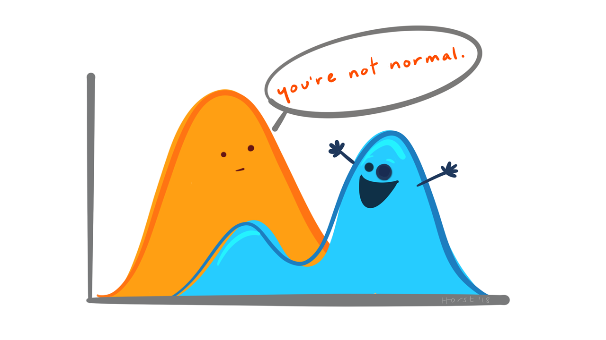

```{r setup, include=FALSE}
options(htmltools.dir.version = FALSE, echo = FALSE)
library(tidyverse)
library(palmerpenguins)
library(cowplot)
library(ggbeeswarm)
```

```{r xaringan-themer, include=FALSE, warning=FALSE}
library(xaringanthemer)
style_duo_accent(
primary_color = "#035AA6",
  secondary_color = "#97aaba",
  inverse_header_color = "#FFFFFF", 
 link_color = "rgb(249, 38, 114)",
      code_font_family = "GlacialIndifferenceRegular",
code_highlight_color = "rgba(255,255,0,0.5)",
  code_font_url = "https://fontlibrary.org/face/glacial-indifference",
  text_font_family = "GlacialIndifferenceRegular",
  text_font_size = "25px",
  text_font_url = "https://fontlibrary.org/face/glacial-indifference",
  header_font_family = "Sifonn",
  header_font_url = "https://fonts.cdnfonts.com/css/sifonn",
)

```

class: center, middle, inverse


# 💻 Today we are going to run through a live coding demo 💻

[We will generate a hypothesis, gather data, and produce some insights over this lecture and the next]


---

# The Question

## Does regular physical activity improve our reaction times?

* What is your expectation?

* Slido.com # 097579

---

# Does regular physical activity improve our reaction times?

* If you do a quick search online, it seems to be generally well supported that regular physical exerices can improve reaction times

--

* We are going to compare ourselves - a small group agains this trend

--

* First we will self-report our levels of regular exercise

--

* Then we will record our action times

---
class: center

# Make a Hypothesis

---
class: center

# Presenting the results

```{r, echo=FALSE, warning=FALSE, message=FALSE}
High <- c(200,250,300,350,213,222)
Medium <- c(198, 345, 369, 250, 270, 280)
Low <- c(200, 250, 345, 198, 250, 234)

reactions <- c(200,250,300,350,213,222,198, 345, 369, 250, 270, 280,200, 250, 345, 198, 250, 234)
activity <- c(rep("High",6), rep("Medium",6), rep("Low",6))

table <- tibble(reactions, activity)
table$activity <- factor(table$activity, levels=c("Low", "Medium", "High"))
plot <- table %>% ggplot(aes(x=activity, y=reactions))


```

```{r, echo=FALSE, warning=FALSE, message=FALSE}
plot+geom_bar(stat="summary")
```

---
class: center

# Box plot

```{r, echo=FALSE, warning=FALSE, message=FALSE}
plot+geom_boxplot()
```

---
class: center

# Dot plot

```{r, echo=FALSE, warning=FALSE, message=FALSE}
plot+geom_beeswarm()
```

---
class: center

# Combos


```{r, echo=FALSE, warning=FALSE, message=FALSE}
plot+geom_boxplot(alpha=0.8)+geom_beeswarm()
```

---

# Statistics

* Reaction times (the response variable) we expect to be quite normally distributed, though cannot be negative

--

```{r, echo=FALSE, fig.alt= "", out.width="80%"}

```

---

# Statistics

* Reaction times (the response variable) we expect to be quite normally distributed, though cannot be negative

* We are looking for a difference between categories

---

# Subject selection

* Fair

* Balanced

* Sample size

* Other confounding variables?

---

# Ethics

* Clearance for human research

* Informed consent

* Identifiable information?


--- 

# Activity levels 1

* Sedentary
You do less than 30 minutes a day of intentional exercise and you don't do anything that can be considered moderate or vigorous
Daily living activities like walking the dog, shopping, mowing the lawn, taking out the trash, or gardening don't count as intentional exercise
You spend most of your day sitting

---

# Activity levels 2

* Moderately Active
You do intentional exercise every day for at least 30 minutes
The baseline for this is walking for 30 minutes at 4mph - this is walking at a brisk pace
You can also do exercise for a shorter period of time providing the exercise is vigorous. An example of vigorous activity is jogging.

--- 

# Activity levels 3

* Very Active 
You do intentional exercise every day that is equivalent to briskly walking for at least one hour and 45 minutes - briskly walking is walking at 4mph
Alternatively, you can do exercise for a shorter period of time providing the exercise is vigorous i.e. you would need to jog for a minimum of 50 minutes to be considered moderately active.


---

# Data collection

* Pick for yourself a random four digit identifier - write this down but don't share it

* Go to (http://www.humanbenchmark.com/tests/reactiontime)

* While you’re there, also please do the other three tests, and write down your score

* Enter your scores here (https://forms.gle/tYxwP12AxA2RwVo66)

---

class: center, middle


# ♻
# Thank you!
# Questions?


